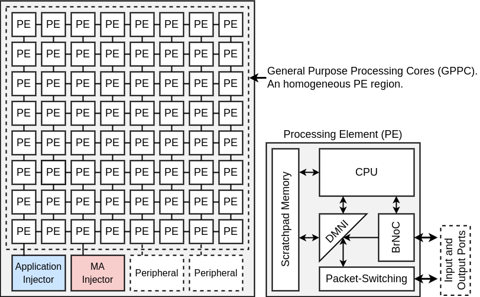

# Phivers

Processor Hive for RS5.
A complete many-core model.

## About

Phivers is based on the models provided by [Memphis](https://github.com/gaph-pucrs/Memphis), [HeMPS](https://github.com/gaph-pucrs/hemps) and its variations.

## Overview

The image below pictures an overview of Phivers.



The many-core is composed of:
* **GPPC:** The GPPC contains a set of identical PEs that execute general purpose applications. 
  Each PE of the GPPC region contains:
	* **CPU:** Phivers adopts the [RS5](https://github.com/gaph-pucrs/RS5) (RV32IM_zicsr) processor.
  	A low integration effort is required to replace this processor with a different architecture.
	Besides the connection to the local memory, the processor has a connection to the DMNI enabling the management of the data transfers using the NoCs;
	* **DMNI:** The [Direct Memory Network Interface](https://github.com/gaph-pucrs/DMNI) merges two hardware modules: NI (Network Interface) and DMA (Direct Memory Access);
  	The advantage of the DMNI compared to the traditional PE implementation (NI+DMA) is a specialized module that directly connects the NoC router to the internal memory;
	* **Scratchpad memories:** The local memories are true dual-port scratchpad memories. One for instructions, other for data.
  	The goal of using this memory model is to reduce the power consumption related to cache controllers and NoC traffic (transfer of cache lines).
	If some application requires a larger memory space than the one available in the local memory, it is possible to have shared memories connected to the system as peripherals;
	* **Packet-Switching:** Phivers adopts the [Hermes](https://github.com/gaph-pucrs/Hermes) Network-on-Chip comprising the the Packet Switching router of the figure above.
  	The main features of the wormhole PS router are: XY routing, round-robin arbitration, input buffering, credit-based flow control.
	* **BrNoC Router:** A lighter version of the BrNoC with removed unicast, the [BrLite](https://github.com/gaph-pucrs/BrLite). This broadcast-based NoC sends message to TARGET or ALL PEs. It also has a set of 5 monitoring message classes dinamically configured by the platform to provide real-time monitoring without interfering in running user tasks. 
* **Peripherals:** Peripherals provide I/O interface or hardware acceleration for tasks running on the GPPC region. 
Examples of peripherals include shared memories, accelerators for image processing, communication protocols (e.g., Ethernet, USB), and Application Injectors.
The system requires at least two peripheral, the [Application Injector and the MA Injector](https://github.com/gaph-pucrs/TaskInjector).
These peripherals are responsible for transmitting applications and the management application to be executed in the GPPC, repectively.

## Peripherals

The connection of peripherals is at the mesh NoC boundary ports due to the benefits of regular  floorplanning for the GPPC region, easing the physical synthesis with peripherals distributed along the GPPC boundary. 
The NoC router was modified in such a way to enable the communication with boundary ports.
Our NoC differentiates data packets from peripheral packets, as depicted in the figure from [overview](#overview).
Data packets are those exchanged by tasks running in PEs, and peripheral packets are those transferred between a task and a peripheral.
A peripheral packet arriving in a boundary PE goes to the peripheral, and not to the DMNI.

# Acknowledgements

* PE model with RISC-V processor and BrLite addition
```
Dalzotto, A. E., Ruaro, M., Erthal, L. V., and Moraes, F. G. (2021). Management Application - a New Approach to Control Many-Core Systems. In Proceedings of the Symposium on Integrated Circuits and Systems Design (SBCCI), pages 1-6.
```

* Many-core model separating GPPC and Peripherals
```
Ruaro, M., Caimi, L. L., Fochi, V., and Moraes, F. G. (2019). Memphis: a framework for heterogeneous many-core SoCs generation and validation. Design Automation for Embedded Systems, 23(3-4):103-122.
```

* PE model with DMNI, scratchpad memories and router
```
Carara, E. A., De Oliveira, R. P., Calazans, N. L., and Moraes, F. G. (2009). HeMPS-a framework for NoC-based MPSoC generation. In Proceedings of the IEEE International Symposium on Circuits and Systems (ISCAS), pages 1345-1348.
```
